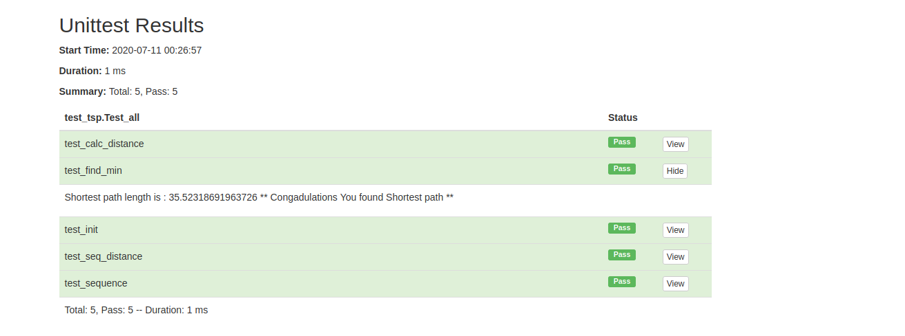

## online_python_code_judgement_panel

This program is a python code judgement based on Flask. 
**test_tsp.py** file is a test file according to unittest, which is written for a designed challange(you will face with the considered challange through running the programm)

## How to Run :

- git clone https://github.com/zahraaghapour/online_python_code_judgement_panel.git
- cd online_python_code_judgement_panel
- pip install virtualenv
- python -m venv <your environment name>
- source <your environment name>/bin/activate
- pip install -r requirements.txt
- python main.py

  - open Web Browser http://localhost:5003/entrance
  - sign up and study given problem as a python challange to solve
  - upload your file (as an example you can upload **tspp.py** file exists in repo)
  - check test result
  

## Example of test result :

